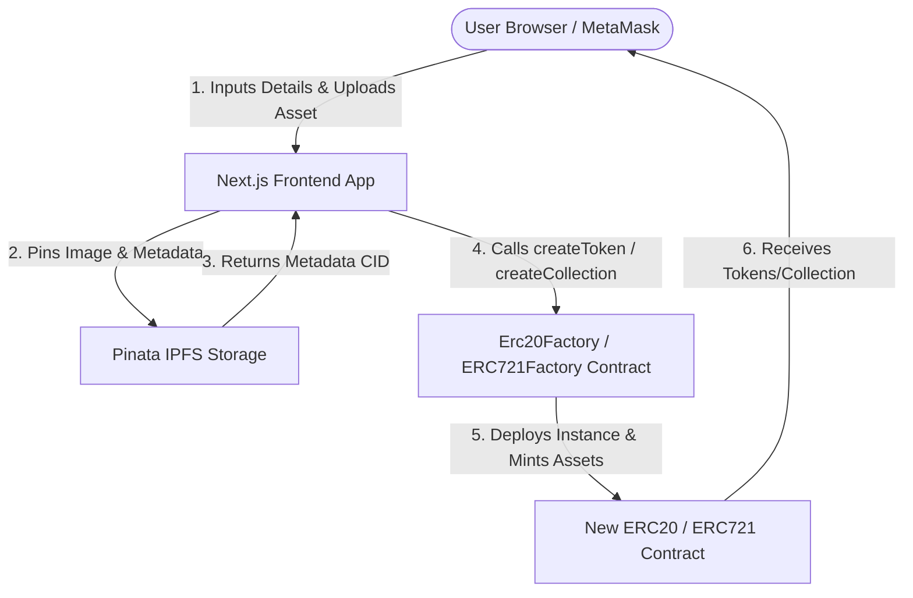

# QryptoLauncher

QryptoLauncher is a decentralized, no-code web application and factory smart contract suite designed for deploying EVM-compatible ERC20 tokens and ERC721 NFT collections directly from a web browser wallet.

---

## Table of Contents

- [Problem Statement](#problem-statement)
- [Solution Overview](#solution-overview)
- [Tech Stack](#tech-stack)
- [Deployed Smart Contracts](#deployed-smart-contracts)
- [Core Features](#core-features)
- [System Architecture](#system-architecture)
- [Repository Structure](#repository-structure)
- [Getting Started](#getting-started)
  - [Prerequisites](#prerequisites)
  - [Frontend Setup](#frontend-setup)
  - [Smart Contracts Setup](#smart-contracts-setup)
- [Security & Best Practices](#security--best-practices)
- [License](#license)

---

## Problem Statement

Deploying custom smart contracts on Ethereum-compatible blockchains traditionally presents significant technical barriers:

1. **Required Technical Expertise**: Developers must write custom Solidity code, set up deployment frameworks (Hardhat, Foundry), write compile scripts, and manage environment variables.
2. **Complex Asset Hosting**: NFT creators must manually format token metadata schemas, run IPFS nodes or configure pinning services, and construct compliant Base URI pointers.
3. **Custodial & High-Cost Services**: Existing launchpads often enforce high deployment fees, require centralized user registration, or retain control over contract ownership and mint privileges.

---

## Solution Overview

QryptoLauncher addresses these challenges by offering a self-serve, non-custodial Web3 portal:

- **Zero Solidity Required**: Standardized, battle-tested OpenZeppelin ERC20 and ERC721 contracts are deployed via factory contracts in a single transaction.
- **Self-Custodial Deployment**: 100% of the token supply and contract ownership are minted directly to the creator's wallet upon deployment.
- **Automated IPFS Pinning**: Integrated Pinata service automatically uploads collection media assets and generates standards-compliant ERC721 metadata folders.
- **Multi-Chain Support**: Native support for **Base Mainnet** and **Sepolia Testnet** with real-time network switching, transparent service fee displays, and automated block explorer integration.

---

## Tech Stack

### Web Application & UI
- **Framework**: Next.js 16 (App Router)
- **Library**: React 19
- **Styling**: Tailwind CSS v4

### Web3 Integration
- **State & Hooks**: Wagmi v3
- **EVM Client**: Viem v2
- **Data Fetching**: TanStack React Query v5
- **Wallet Provider**: MetaMask (Injected Provider)

### Smart Contracts & Development
- **Language**: Solidity `^0.8.28` (Target EVM: `cancun`)
- **Libraries**: OpenZeppelin Contracts v5
- **Tooling**: Hardhat, Hardhat Toolbox
- **Testing**: Ethers.js v6, Mocha, Chai

### Decentralized Storage
- **Provider**: Pinata IPFS Gateway & REST API

---

## Deployed Smart Contracts

The factory contracts are deployed and verified on both Base Mainnet and Sepolia Testnet.

### Base Mainnet (Chain ID: `8453`)

| Contract | Address | Explorer |
| :--- | :--- | :--- |
| **ERC20 Factory** | `0x172B0EaDf99c26dc03e4AAF503dE1791c540844a` | [Basescan](https://basescan.org/address/0x172B0EaDf99c26dc03e4AAF503dE1791c540844a) |
| **ERC721 Factory** | `0xc715DEd4f82A9AEe2CD172A9da3431269C750d21` | [Basescan](https://basescan.org/address/0xc715DEd4f82A9AEe2CD172A9da3431269C750d21) |

### Sepolia Testnet (Chain ID: `11155111`)

| Contract | Address | Explorer |
| :--- | :--- | :--- |
| **ERC20 Factory** | `0xd809A03876fe8c10f1dB5FD0bf0C80B4eD873389` | [Etherscan](https://sepolia.etherscan.io/address/0xd809A03876fe8c10f1dB5FD0bf0C80B4eD873389) |
| **ERC721 Factory** | `0x895C7F82587c63942a973bf1e4c3a998aF1040f3` | [Etherscan](https://sepolia.etherscan.io/address/0x895C7F82587c63942a973bf1e4c3a998aF1040f3) |

---

## Core Features

### 1. ERC20 Token Launcher
- Configurable Name, Symbol, and Initial Supply.
- Automated 18-decimal supply calculation (`parseUnits`).
- Minting of 100% initial supply to the deployer wallet.
- Fixed 0.00027 ETH protocol fee per deployment.

### 2. ERC721 NFT Collection Launcher
- Image upload with automatic Pinata IPFS metadata compilation.
- Configurable collection name, symbol, description, and maximum supply cap.
- Owner-controlled batch minting interface.
- Automatic token URI pointer configuration (`ipfs://<cid>/`).

### 3. Analytics & Portfolio Dashboard
- Real-time indexing of all user-deployed tokens and collections using multicall factory queries.
- Direct links to contracts on Basescan and Etherscan.
- Display of total token supplies, total minted NFTs, and token balances.

### 4. Multi-Network Selector
- Seamless network switching between Base Mainnet and Sepolia Testnet in the top navigation header.
- Dynamic network status badges and contextual safety notifications.

---

## System Architecture



---

## Repository Structure

```
QryptoLauncher/
├── frontend/                     # Next.js Web Application
│   ├── app/                      # Next.js App Router pages
│   │   ├── page.js               # Homepage & overview
│   │   ├── erc20/page.js         # ERC20 creation flow
│   │   ├── erc721/page.js        # ERC721 creation & minting flow
│   │   ├── dashboard/page.js     # User portfolio & analytics
│   │   └── api/pinata/sign/     # Pinata JWT signature endpoint
│   ├── components/               # UI & Header navigation components
│   ├── lib/                      # Wagmi config, contract ABIs, and IPFS helpers
│   └── package.json
└── SmartContracts/               # Hardhat Smart Contract Development Workspace
    ├── contracts/                # Solidity source code
    │   ├── Erc20Factory.sol      # ERC20 Token & Factory contract
    │   └── ERC721Factory.sol     # ERC721 Collection & Factory contract
    ├── scripts/                  # Deployment scripts
    ├── test/                     # Hardhat test suites
    └── hardhat.config.js
```

---

## Getting Started

### Prerequisites

- **Node.js**: `v18.0.0` or higher
- **Package Manager**: `npm` or `pnpm`
- **Browser Wallet**: MetaMask installed
- **Pinata Account**: API JWT token for IPFS pinning

---

### Frontend Setup

1. Navigate to the `frontend` directory:
   ```bash
   cd frontend
   ```

2. Install dependencies:
   ```bash
   npm install
   ```

3. Configure environment variables by creating `.env.local`:
   ```env
   PINATA_JWT=your_pinata_jwt_secret_here
   ```

4. Start the local development server:
   ```bash
   npm run dev
   ```

5. Open `http://localhost:3000` in your browser.

---

### Smart Contracts Setup

1. Navigate to the `SmartContracts` directory:
   ```bash
   cd SmartContracts
   ```

2. Install dependencies:
   ```bash
   npm install
   ```

3. Run the test suite:
   ```bash
   npx hardhat test
   ```

4. Deploy contracts to Base Mainnet (requires `PRIVATE_KEY` and `ALCHEMY_API_KEY` set in Hardhat configuration):
   ```bash
   npx hardhat run scripts/deploy.js --network base
   ```

---

## Security & Best Practices

- **Non-Custodial**: Contracts are owned exclusively by the deployer's address (`msg.sender`).
- **OpenZeppelin Standard Implementations**: Leverages audited OpenZeppelin ERC20 and ERC721 base implementations.
- **Server-Side API Key Isolation**: Pinata JWT credentials are kept strictly server-side inside Next.js API routes (`/api/pinata/sign`).

---

## License

This project is licensed under the [MIT License](LICENSE).
